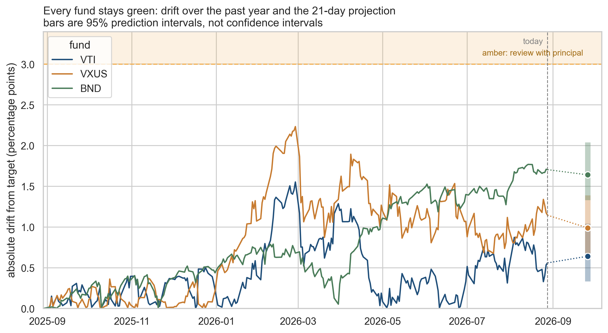
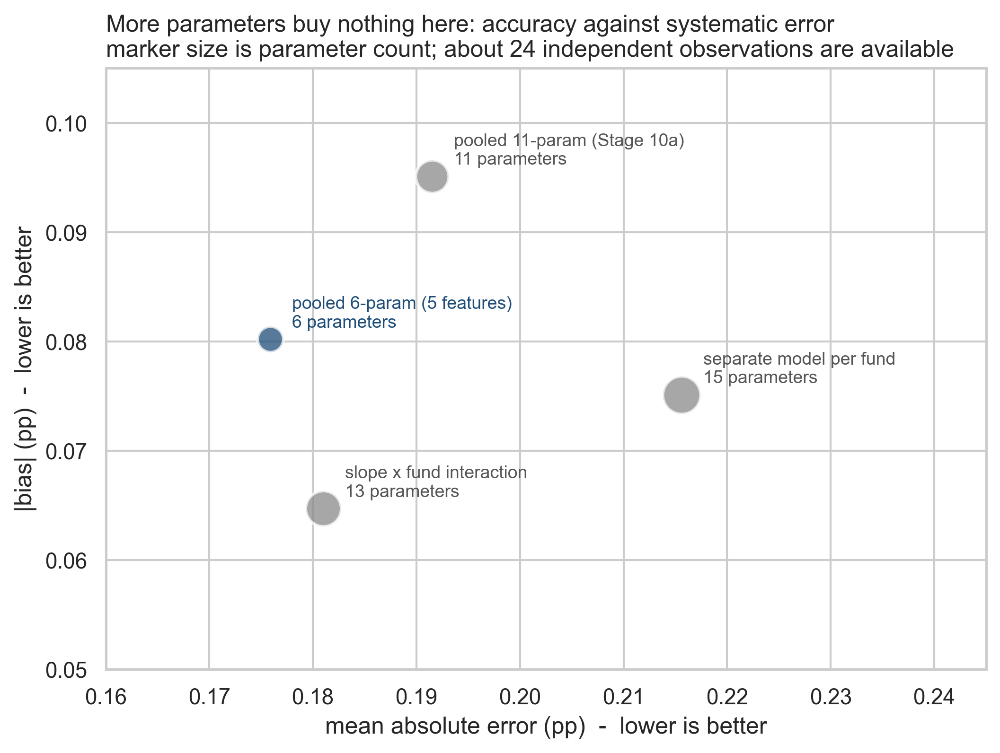
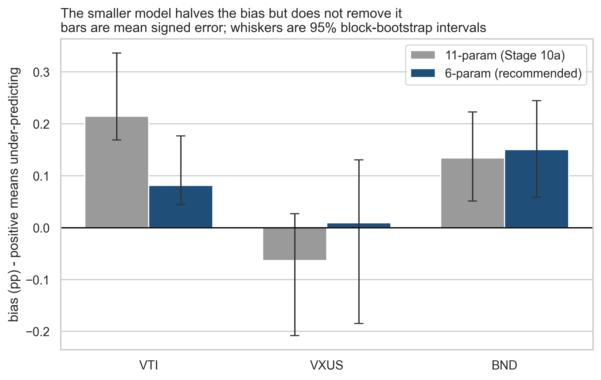

# Portfolio Drift Monitor - findings for the firm principal

**Prepared:** Stage 12, FRE 5040. **Data through:** 2026-08-28.
**Model:** 6-parameter chronological regression, 21-trading-day horizon.

## Headline

**No fund needs attention this month, and that conclusion survives every assumption
tested.** The widest 95% upper bound any scenario produces is 2.14pp
against an amber line of 3pp.

| Fund | drift today | projected 21 days | 95% interval | adjusted | band |
|---|---|---|---|---|---|
| VTI | 0.56pp | 0.64pp | [0.33, 1.04] | 0.56pp | green |
| VXUS | 1.15pp | 0.99pp | [0.68, 1.39] | 0.98pp | green |
| BND | 1.70pp | 1.64pp | [1.33, 2.04] | 1.49pp | green |

## The bias Stage 11 flagged cannot be modelled away

Stage 11 measured a systematic under-prediction of 0.215pp for VTI
and 0.134pp for BND and asked Stage 12 to correct it with per-fund
interactions. That correction is not available, for a reason worth stating:

- **The interaction already exists.** `abs_drift_rel` is `abs_drift` divided by the target
  weight, which makes it that interaction under another name. Adding it explicitly gives a
  singular design matrix.
- **The bias is not in the training window.** In-sample per-fund bias is zero to machine
  precision, because the fund dummies force it. Nothing fitted on that window can see the
  test bias.
- **The target moved.** Average 21-day-ahead drift rose +0.31pp between
  windows, and BND's rose +0.81pp.
- **More freedom makes it worse.** Separate per-fund models spend 15 parameters, score
  MAE 0.216 against
  0.176, and leave all three funds biased.

The response is the smaller model plus a published offset, not a bigger model.

## Sensitivity: which assumption to argue about

| assumption | headline | change |
|---|---|---|
| baseline | 2.04pp | +0.00pp |
| Regime (test window vs training window) | 1.73pp | -0.31pp |
| Bias adjustment (raw vs measured offset) | 1.89pp | -0.15pp |
| Model specification (6-param vs 11-param) | 2.14pp | +0.10pp |
| Confidence level (95% vs 99%) | 2.12pp | +0.07pp |
| Interval shape (empirical vs Gaussian) | 2.02pp | -0.02pp |

**Alternate scenario.** If the next month resembles the training window rather than the
last twelve, BND's upper bound falls from 2.04pp to
1.73pp. That is 0.31pp, against
0.10pp
for the model specification. **Regime dominates specification by roughly three to one.**

## Assumptions and risks

- Every interval here is a **floor**, not a bound: 42 test dates cannot describe their own
  uncertainty at a 21-day timescale (Stage 11).
- **BND carries the residual bias** and is also the fund closest to amber.
- **One year, one regime, no market stress in the window.**
- The published offset is a measured observation, not a fitted parameter.

## Recommended next steps

1. **No rebalancing action this month.**
2. **Extend the data window before touching the model.** The tornado says it is worth
   three times more, and it is the only fix for the interval being a floor.
3. **Re-estimate if realized volatility leaves its recent band** (about 13% VTI, 17% VXUS,
   4% BND annualized).
4. **Report BND on its upper bound**, not its point estimate.

## Method, in one paragraph

Daily closes for VTI, VXUS and BND over a rolling one-year window are cleaned (Stage 06),
turned into drift against a 60/30/10 target and into features (Stage 09), then regressed
on 21-trading-day-ahead absolute drift using a chronological split that trains on the
first 80% of *dates* (Stage 10a). Intervals come from the residual distribution rather
than the regression's own standard errors, which assume an independence this target does
not have (Stage 11). Against a persistence baseline the model improves MAE by
25.8%.
