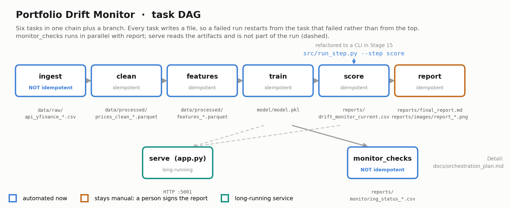

# Orchestration plan

**Stage 15.** How the Portfolio Drift Monitor runs as a pipeline rather than as a notebook
somebody executes. Companion to `src/run_step.py`, `docs/monitoring_plan.md` (what to watch)
and `docs/handoff_plan.md` (what to do when it breaks).

Stage 13 made the analysis callable. Stage 14 said what to watch. This stage says **what is
actually running to be watched**, and proves one piece of it runs without a person in front
of it.



## 1. The tasks

Real paths from this repo, not placeholders. Every task is a function that already exists
in `src/`; the pipeline notebook calls them in this order today.

| # | Task | Inputs | Outputs | Implemented by |
|---|---|---|---|---|
| 1 | **ingest** | yfinance: VTI, VXUS, BND, `period='1y'` | `data/raw/api_yfinance_VTI-VXUS-BND_<stamp>.csv` | `ingest_prices` in the pipeline |
| 2 | **clean** | newest `data/raw/api_yfinance_*.csv` | `data/processed/prices_clean_<stamp>.parquet` | `cleaning.clean_prices`, `cleaning.drop_incomplete_days` |
| 3 | **features** | `data/processed/prices_clean_*.parquet` | `data/processed/features_full_<stamp>.parquet`, `features_model_ready_<stamp>.parquet` | `features.build_feature_matrix` |
| 4 | **train** | `data/processed/prices_clean_*.parquet` | `model/model.pkl` | `service.build_bundle`, `service.save_bundle` |
| 5 | **score** | `model/model.pkl` + newest cleaned prices | `reports/drift_monitor_current.csv`, `data/processed/monitor_<stamp>.csv` | **`src/run_step.py --step score`** |
| 6 | **monitor_checks** | matrix + bundle + wall clock | `reports/monitoring_status_<stamp>.csv` | `service.monitoring_checks` |
| 7 | **report** | bundle + matrix | `reports/final_report.md`, `reports/images/report_*.png` | `notebooks/delivery.ipynb` |
| 8 | **serve** | `model/model.pkl`, `data/processed/` | HTTP on `127.0.0.1:5001` | `app.py` |

**Task 8 is not a DAG node.** It is a long-running process that reads the artifacts the
other tasks write. It is in the table because leaving it out would suggest a restart is
free, and it is not: a running `app.py` holds the old model in memory, so `train` has no
effect on what is served until the process is restarted.

## 2. Dependencies

```
ingest -> clean -> features -> train -> score -> report
                                  |
                                  +-> monitor_checks
```

| Task | Depends on | Why |
|---|---|---|
| clean | ingest | Needs a raw file to clean |
| features | clean | Rolling and lag features are meaningless on unsorted rows or across date gaps, which is exactly what `clean` fixes (Stage 08) |
| train | clean | `build_bundle` rebuilds the matrix internally, so it needs prices rather than the features artifact |
| score | train | Needs coefficients **and** the residuals the prediction interval is built from |
| monitor_checks | train | Compares the bundle's bias and MAE against the published thresholds |
| report | score | Quotes the monitor table it produces |

**What can run in parallel.** `monitor_checks` and `report` both depend only on things that
exist after `score`, and neither writes what the other reads, so they can run concurrently.
Nothing else can: tasks 1 to 5 are a strict chain, because each consumes the file the
previous one writes.

**In practice parallelism buys nothing here.** The whole chain runs in seconds on one
machine, and `score` measures at **0.10s**. Running two tasks at once to save a fraction of
a second, at the cost of a scheduler that has to manage concurrency, is the wrong trade at
this size. The parallel branch is recorded because it is true, not because it should be
used.

## 3. Idempotency

| Task | Idempotent | Why |
|---|---|---|
| ingest | **No** | The window rolls. The same command on a different day returns a different year of prices, so re-running it is not a repeat, it is a new observation |
| clean | Yes | A deterministic function of its input file |
| features | Yes | Every window is causal and deterministic; `assert_no_lookahead` tests exactly this |
| train | Yes | OLS on a fixed design matrix. Same prices in, same coefficients out |
| score | Yes | **Verified**, not assumed: two runs against the same prices, model and `--stamp` produce a byte-identical CSV |
| monitor_checks | **No** | The freshness check compares the data date against `now`, so its output changes with the clock even when nothing else does |
| report | Yes | Deterministic given the bundle and matrix; the figures are seeded |
| serve | n/a | Not a run |

**The two non-idempotent tasks are non-idempotent for opposite reasons, and both matter.**
`ingest` changes because *the world* moved, which is why every document in this repo prints
its data date and why the pipeline's self-check cells recompute their own quoted figures.
`monitor_checks` changes because *time* passed, which is the point of a freshness check: a
check that returned the same answer tomorrow would not be monitoring anything.

Everything between them is a pure function of its inputs. That is what makes a restart from
the middle of the DAG safe.

## 4. Logging and checkpoints

**Every task writes a file, and that file is the checkpoint.** There is no separate
checkpoint mechanism because there does not need to be one: the artifacts already on disk
are the state. A run that fails at `train` restarts at `train`, because `clean` and
`features` left their outputs behind.

**Every artifact is written twice where a person reads it.** A timestamped copy is the audit
trail; a stable-named copy is what Dana opens. `drift_monitor_current.csv` never has a date
in its name because she would otherwise have to know today's date to find her spreadsheet,
and `monitor_<stamp>.csv` keeps the history the monitoring plan depends on.

**Writes go through a temp file and an atomic rename.** `run_step._write_atomic` writes
`x.csv.tmp` then calls `os.replace`. A reader that opens a file mid-write sees a truncated
CSV and *no error*, which is the worst failure shape available: silently wrong rather than
loudly broken.

What each task logs:

| Task | Logs |
|---|---|
| ingest | Start and end, ticker list, rows returned, output path, retry attempts |
| clean | Rows in and out, rows dropped by `drop_incomplete_days`, output path |
| features | Rows in and out, feature count, missing-value counts, output path |
| train | Feature list, cut date, train and test sizes, MAE, RMSE, bias, output path |
| score | Resolved input path, model source (`loaded` or `fitted`), per-fund drift, projection and band, both output paths, elapsed seconds |
| monitor_checks | One line per check with its value, threshold and status; a WARNING per ALERT |
| report | Artifact paths and sizes |

`run_step.py` logs to **stdout and to `logs/run_step.log`**: stdout so a scheduler captures
it, the file so a person can read yesterday's run. Exit codes are **0** success, **1** task
failure, **2** usage error, which is what lets a scheduler tell "it broke" from "you called
it wrong".

## 5. Failure points and retry policy

| Failure | Task | Transient | Policy |
|---|---|---|---|
| yfinance unreachable, rate-limited or returns an empty frame | ingest | **Yes** | **Retry 3 times, linear backoff 2s / 4s / 6s.** Then fail loudly and publish nothing: a stale CSV is worse than an absent one, because only the `as_of` column distinguishes them |
| Reading a parquet while `clean` is still writing it | score | **Yes** | Retry the read, same policy. This is the one transient fault downstream of ingest |
| Unbalanced panel: a ticker drops out | clean | No | Fail. Stage 14's row-count check catches it; refitting on an unbalanced panel is silently wrong |
| Rank-deficient design matrix | train | No | Fail. `fit_ols` already raises with the reason. Stage 12 documents the case |
| Missing model file | score, serve | No | Fail with the name of the notebook to run. This is the expected fresh-clone state |
| Port 5001 already bound | serve | No | Fail. `PORT=5002` is the fix, not a retry |

**Retry is only for transient faults, and the policy follows from that rather than from
taste.** Every task except `ingest` is a deterministic function of files already on disk: if
`train` raises, it will raise identically on the next attempt. Retrying a deterministic
failure delays the error, buries it under noise, and makes the log harder to read.
`run_step.retry` therefore catches a **narrow** exception tuple, `(OSError,)`, and wraps
only the file read. Catching `Exception` there would swallow a rank-deficient matrix and
retry it three times before reporting it, turning a clear error into a slow mysterious one.

## 6. What to automate now, and what stays manual

**Automate now: tasks 1 to 6.** Deterministic, fast, and requiring no judgement. One cron
entry, monthly, matching the retraining cadence Stage 14 derived from the 21-day horizon:

```
0 7 1 * *  cd ~/…/project && /path/to/conda/envs/bootcamp_env/bin/python src/run_step.py --step score >> logs/cron.log 2>&1
```

**Keep manual, and these are decisions rather than omissions:**

- **`report` (task 7).** Stage 12 established that the principal's document carries caveats
  a person has to stand behind: the interval is a floor, the bias is regime drift, the
  window is one year. Generating that text automatically would publish a judgement nobody
  made.
- **Threshold changes.** The principal owns them (Stage 14). `/run_full_analysis/<amber>/<red>`
  makes the question cheap to *explore*; changing the default stays a person's call.
- **Out-of-cycle refits.** The triggers are automated; pulling the trigger is not.
- **Restarting `app.py` after a refit.** Deliberate, because a restart drops in-flight
  requests and the monitor is not so urgent that it cannot wait for someone to look.

**Why not Airflow or Prefect.** Six tasks, one strict chain, one machine, one operator, a
monthly cadence, and a run that finishes in seconds. Airflow's scheduler, metadata database
and web server would be more infrastructure than the analysis it orchestrates, and would add
failure modes of their own to a system whose current failure modes are all understood. A
CLI plus cron is the right size. The honest test is that **nothing in this plan would be
easier with a DAG framework at this scale**, and the moment that stops being true, the task
boundaries here map onto one directly.

## 7. The refactored task

`src/run_step.py --step score`. Chosen from the eight because it is the task whose output
someone is waiting for, it is deterministic so it is safe to re-run, and it sits where a
scheduled run either produces the deliverable or does not.

```bash
cd project
python src/run_step.py --step score
python src/run_step.py --step score --amber 2 --red 4   # explore a tighter threshold
python src/run_step.py --step score --refit             # refit and overwrite model/model.pkl
```

Verified behaviour: 0.10s on the current data, byte-identical output across two runs with
the same `--stamp`, exit code 1 on a missing input with a full traceback in the log, exit
code 2 on `--red` below `--amber`, and a WARNING line naming any fund that reaches amber.
The `--amber 2 --red 4` run flips BND to amber on its **upper bound** of 2.04pp rather than
its point forecast of 1.64pp, which is the distinction Stage 11 spent its length
establishing.
