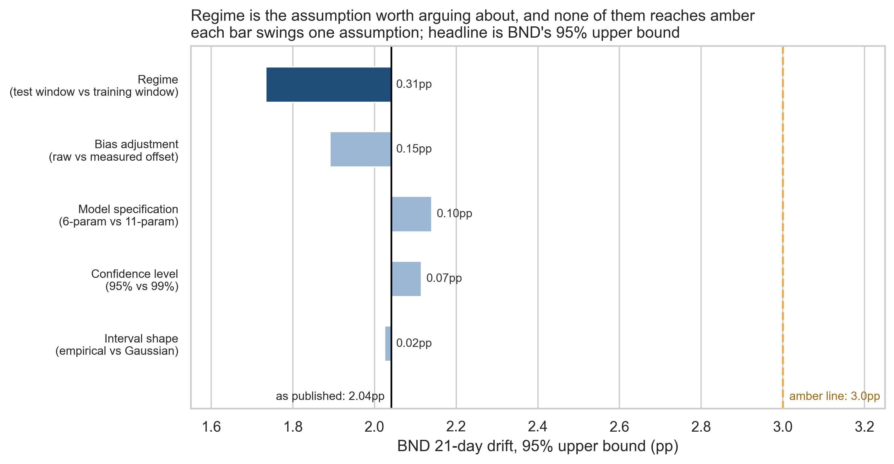

# Portfolio Drift Monitor - findings for the firm principal

**Prepared:** Stage 12, FRE 5040. **Data through:** 2026-08-28.
**Model:** 6-parameter chronological regression on a 21-trading-day horizon.
**Companion artifact for client service:** `drift_monitor_current.csv`.

## Headline

**No fund needs attention this month, and that conclusion survives every assumption
tested.** The widest 95% upper bound any scenario produces is 2.14pp
against an amber line of 3pp.

| Fund | drift today | projected 21 days | 95% interval | bias-adjusted | band |
|---|---|---|---|---|---|
| VTI | 0.56pp | 0.64pp | [0.33, 1.04] | 0.56pp | green |
| VXUS | 1.15pp | 0.99pp | [0.68, 1.39] | 0.98pp | green |
| BND | 1.70pp | 1.64pp | [1.33, 2.04] | 1.49pp | green |

## What changed since Stage 11

Stage 11 asked Stage 12 to correct a per-fund bias of 0.215pp for
VTI and 0.134pp for BND using per-fund interactions. **That
correction is not available, and the reason is worth the principal's attention because it
changes where the remaining risk sits.**

- **The interaction was already in the model.** `abs_drift_rel` is `abs_drift` divided by
  the target weight, which makes it that interaction under a different name. Adding it
  explicitly gives a singular design matrix; a per-fund model cannot hold both columns.
- **The bias is not in the training window at all.** In-sample per-fund bias is zero to
  machine precision, because the fund dummies force it. Nothing fitted on that window can
  see the out-of-sample bias.
- **The target moved.** Average 21-day-ahead drift rose +0.31pp between
  the two windows, and BND's rose +0.81pp.
- **More model makes it worse.** Separate per-fund models spend 15 parameters against
  about 24 independent observations, score MAE
  0.216 against
  0.176, and leave all three funds biased.

So the monitor publishes the **smaller** model with a **measured offset** beside the raw
number, and labels the offset as an observation rather than a parameter.

## Which assumption to argue about

| assumption | BND 95% upper bound | change |
|---|---|---|
| baseline | 2.04pp | +0.00pp |
| Regime (test window vs training window) | 1.73pp | -0.31pp |
| Bias adjustment (raw vs measured offset) | 1.89pp | -0.15pp |
| Model specification (6-param vs 11-param) | 2.14pp | +0.10pp |
| Confidence level (95% vs 99%) | 2.12pp | +0.07pp |
| Interval shape (empirical vs Gaussian) | 2.02pp | -0.02pp |

**The alternate scenario is regime.** Everything above assumes the next month resembles
the last twelve. If it instead resembles the *training* window, drift was
0.31pp lower on average and BND's upper bound falls from
2.04pp to 1.73pp.

That assumption swings the answer 3.1 times further than the
model specification and 19 times further
than the choice between a Gaussian and an empirical interval. **The next unit of effort
belongs on the data window, not on the model.**

## Assumptions and risks, in plain language

| Assumption | If it is wrong |
|---|---|
| The next month behaves like the last twelve | The largest single error source, worth 0.31pp on the headline |
| The measured bias offset carries forward | Worth 0.15pp. It is an observation from one window, not a fitted parameter |
| 42 test dates can describe their own uncertainty | Stage 11 showed they cannot at a 21-day timescale. Every interval here is a **floor** |
| Errors come from one distribution | BND's residuals are the least well behaved, so BND's interval is the least trustworthy |
| Prices keep arriving without gaps | Stage 06 fills them and `close_was_filled` flags them; currently constant, so untested |

**Risks worth naming.** BND is simultaneously the fund closest to amber and the fund the
model is least right about, which is the worst of the three pairings. The data covers one
year and one regime, with no market stress in the window.

## Recommended next steps

1. **No rebalancing action this month.** No fund reaches amber under any assumption tested.
2. **Extend the data window before touching the model.** The sensitivity analysis says it
   is worth roughly three times more, and it is the only fix for the interval being a floor.
3. **Re-estimate if realized volatility leaves its recent band** (about 13% VTI, 17% VXUS,
   4% BND annualized).
4. **Report BND on its upper bound**, not its point estimate. It is the only fund whose
   interval comes within 1.0pp of amber.

## Method, in one paragraph

Daily closes for VTI, VXUS and BND over a rolling one-year window are cleaned (Stage 06),
converted to drift against the 60/30/10 target and to features (Stage 09), then regressed
on 21-trading-day-ahead absolute drift using a split that trains on the first 80% of
*dates* (Stage 10a). Intervals are built from the residual distribution rather than the
regression's own standard errors, which assume an independence this target does not have
(Stage 11). Against a persistence baseline the model improves mean absolute error by
**25.8%**. Full reasoning for each choice, including the alternatives rejected,
is in `decision_log.json`.
